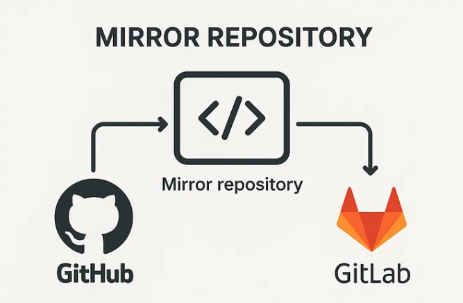

# **Mirror-Repository-GitHub & GitLab**

The objective of this project is to create an automated mirror repository that continuously synchronizes a GitHub repository with GitLab, ensuring redundancy, reliability, and seamless cross-platform access to the codebase.

# Architecture

1. #### Create Blank Project On GitLab
        Give Project Name - Mirror-repo-github-project
        Repository URL - https://github.com/username/mirror-repo-github-project
        Set visibility level to - Public
2. #### Create New Repository in GitHub
        Set Repository Name to - Mirror-repo-github-project
        set visibility level to public 
        Add Redme File 
3. #### Create a Token in GitHub
        - Navigate to **GitHub → Settings → Developer settings**
        - Select **Personal Access Tokens**
        - Generate a new token with:
        - repo permission

        - Copy and securely store the token

4. #### Clone and Make Your First Commit

        - git clone https://gitlab.com/ops-group1934203/mirror-repo-github-project.git

    #### Create a new file, for example, index.html, add some content, and push it.

        git add .
        git commit -m "added index.html file"
        git push -u origin main

5. #### Test Branching and Merge Requests

    #### Create and switch to a new branch dev:
        git checkout -b dev
    
    #### Add a new file, about.html, commit, and push the branch:
        git add .
        git commit -m "added file at dev branch"
        git push -u origin dev

6. #### Merge Flow request 
        
    After pushing the new branch, GitLab notifies you that a branch has been pushed and suggests creating a merge request.
    You can then create the merge request, add a title/description, and assign reviewers.Once the merge request is completed, GitLab updates its main branch.
    If repository mirroring is configured, the changes are synchronized with GitHub.
 

        After the merge:

        The dev branch is merged into main on GitLab.
        The main branch is automatically pushed to GitHub.
        The new commit (the merge) and the updated main branch history now appear on GitHub.

    ## Conclusion

    This project demonstrates the practical implementation of a mirror repository between GitHub and GitLab using Git version control. By automating repository synchronization, the solution ensures code redundancy, high availability, and seamless cross-platform access. The project also showcases real-world DevOps practices such as branching, merge requests, and secure authentication using access tokens, making it suitable for enterprise and academic use cases.
